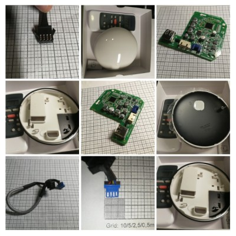

# Midea WiFi Smart Modem WF-60A1

This is a "modem" unit for commercial Midea HVAC (like ceiling mounted splits). 
It's 2-pieces device: 
1. The round-thing modem which take inside next part: 
2. next part is The infamous **OSK103** wifi dongle for Midea-based AC units.

I found those Manufacturers/Brans that use in their AC this "modem" too:
- Rotenso
- Kaisai
- MDV
- others using Midea/OSK103

This modem is connected to AC internal unit using 4-wire cable (5m long), the pinout is written on the PCB :smile: , but the connector for internal unit is some custom JST 2.0mm connector (I couldn't find similar plug with locking mechanism):

Pin|Label|Info
-|-|-
1|A|RS485-A
2|B|RS485-B
3|E|GND
4|12V|+12V

There is also 2nd connector too, that looks like JST 2.5mm with locking too, for some network connection too.

Each pair **A** and **B** goes to it's own RS485 transceiver: SN65HVD3082ED (marking ```VP3082``` ). 

On the board is MCU in QFP-44 package: [SH79F6484](https://en.sinowealth.com/detaile?pro_id=18) by Sino Wealth, it has only 2 hardware UART but is no problem to emulate one more (2x RS485 + UART for OSK103).
If have 64k for program (seems like OTP memory by description), and 1536 bytes of RAM (256+1280).

Interesting finding is IrDA transceiver that is used for IR receiver.

The USB connector for the OSK103 is with :cursing_face: the keys so normal USB plug won't fit - you have to mill or file-off the plastic in usb plug insert.

Photos you'll find in [Photos](Photos/) of board, chassis, cable.



## But WHY?

I know I can just replace the OSK103 with e.g.: https://github.com/dudanov/iot-uni-dongle :smile: and sit back happy, but I still have to buy this round-thing that is hard to place anywhere (especially if AC is built-in into plasterboard celling).

So why not to get rid of it completely and just replace this with just "one thing with ESP8266" *(and few other parts)* :question:

And this is my final goal :grin:

# The Protocol

See the [Protocol](protocol.md)


## EOF