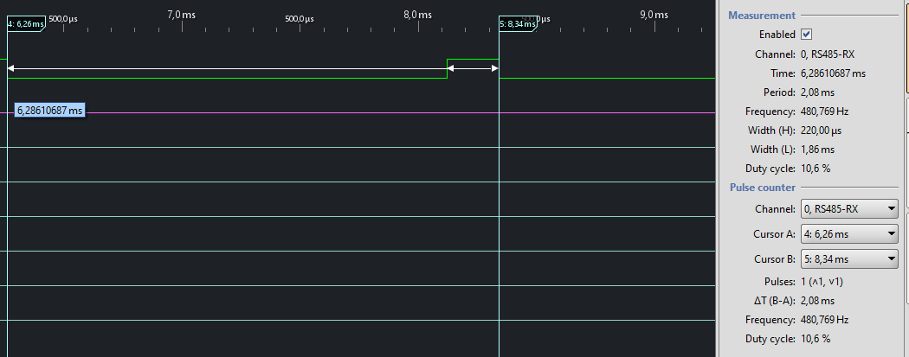
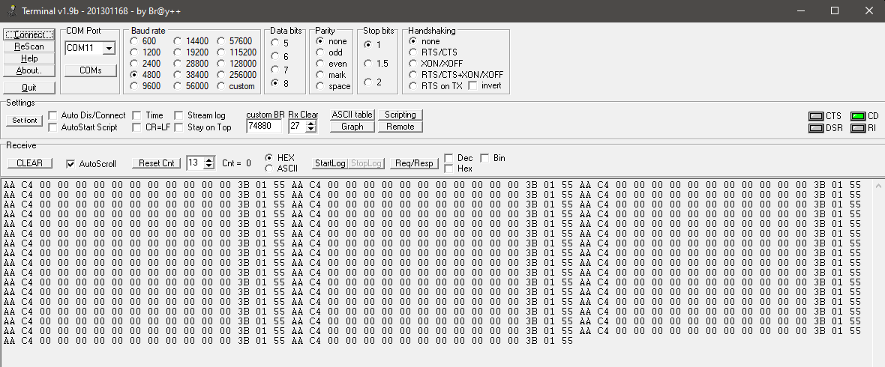

# The Serial Protocol

*This I want to update as I'll progress with it...*

For now I have powered up the modem from bench PSU without any wifi module nor connecting it to AC. Into the bus that goes to AC I've connected it to some random USB-RS485. On PC I had run a serial port terminal (Terminal v1.9b by Br@y++ :muscle: ).

Using **Open Bench Logic Sniffer** (OLS) I have managed to get the baudrate: I used two of those "pulses followed by long 0" whose became after doing a bit of math to be 0x00.

The port baudrate is: **4800** bps

The 0x00 byte have:
```
T(0x00)=2,08ms , so:
2,08ms/10=>208µs , so:
1s / 0,000208s = 4807,69 ~= 4800 bps
```



Below is screen-shot of terminal, and in text file [capture0.txt](protocol/capture0.txt) is the terminal content (in [capture0-CRLF.txt](protocol/capture0-CRLF.txt) is with line breaks ).


I took a quick look into code of [MideaUART](https://github.com/dudanov/MideaUART) and I can see that the frame starts from :trumpet: :trumpet: **```0xAA```** - that's too much coincidence :monocle_face: 

In [protocol](protocol/) directory you can see few screen shoots from OLS.

In near future I'll connect OSK103 and ESP8266 dongle , and I'll try capture data from-to AC unit too.


#### EOF